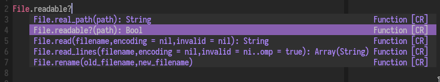
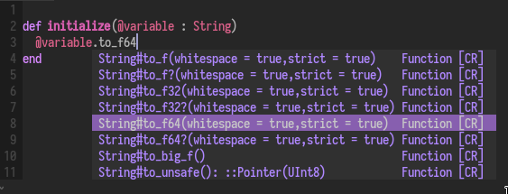

# Deoplete source for Crystal

Provides integration between [Cracker](https://github.com/TechMagister/cracker)
and Deoplete, an asynchronous completion framework for vim.

Work in progress.

## Demo





## Installation

Using [Plug](https://github.com/junegunn/vim-plug):

```vim
Plug 'Shougo/deoplete.nvim'
Plug 'yoru/deoplete-crystal'
```

You need to have [Cracker](https://github.com/TechMagister/cracker) installed in
your machine.

Compile it and move the binary to your $PATH (e.g. `/usr/local/bin/cracker`).

## Configuration

```vim
let g:deoplete#sources#crystal#bin = '/usr/local/bin/cracker'
let g:deoplete#sources#crystal#lib = '/usr/lib/crystal'
```

## License

Public domain.
